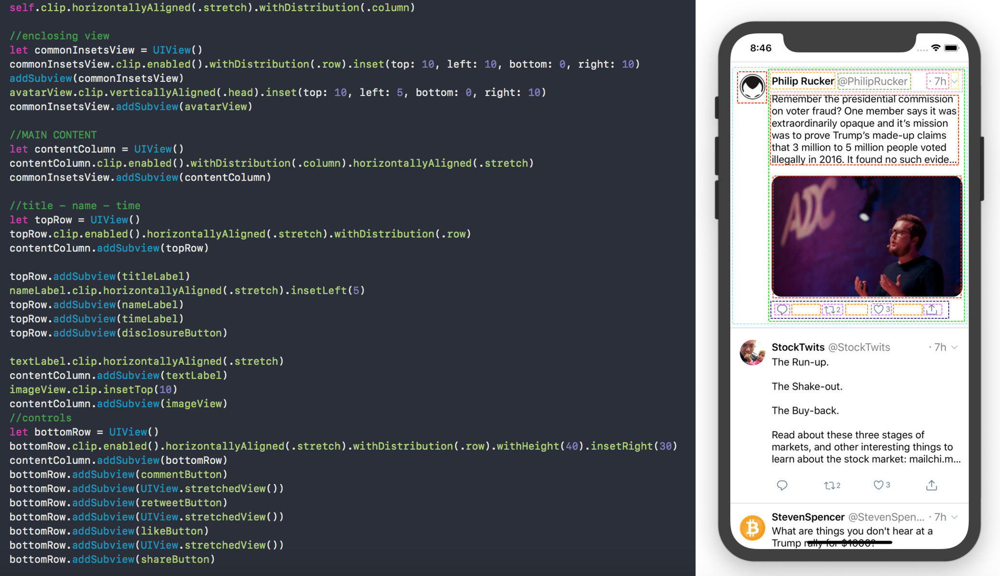

# ClipLayout

[](https://cocoapods.org/pods/ClipLayout)
[](https://cocoapods.org/pods/ClipLayout)
[](https://cocoapods.org/pods/ClipLayout)

## Example

To run the example project, clone the repo, and run `pod install` from the Example directory first.


## Installation

ClipLayout is available through [CocoaPods](https://cocoapods.org). To install
it, simply add the following line to your Podfile:

```ruby
pod 'ClipLayout'
```

## 💫 Expressiveness

<p align="center">
     
<p/>

It's easy to read and takes only few lines of code to make complex layout. 
## 🚀 Performance

<p align="center">
     
<p/>

It's the fastest Layout Engine compared to other popular libraries.
## 📐 Automatic estimations
You don't have to specify the size. ClipLayout will try to estimate how much space the view needs for it's content. And place subview in the center of the superview by default. 
## ✂️ Trimming

<p align="center">
     
<p/>

If views don't fit on the screen their size will be adjusted.
## ✨ Animations out of the box

<p align="center">
     
<p/>

It's easy to animate changes in Clip Layout. Just alter the layout however you want and call `clip.invalidateLayout()` on the superview in animation context. 
```swift
view.clip.withDistribution(flag ? .column : .row)
UIView.animate(withDuration: 0.8) {
    self.superview.clip.invalidateLayout()
}
``` 

## 🙋‍♂️ RTL language support
RTL support is enabled by default on any view. If you use `distribution == .row`, views will be mirrored in horizontal axis. To disable RTL set `supportRightToLeft = false`.

## 🍻 Interoperability
You can mix and match ClipLayout with Auto Layout or any other framework. You only need to specify property on UIView `enable = true` on parent and descendant views that use Clip Layout. 

## 🎛 Dynamic Collection Cells
You set up the Cell that conforms to DataBinder and inherits ClipCell
```swift
class DynamicCell: ClipCell, DataBinder {
  func set(data: SomeData) {
  }
 }
```
Then you just use ClipCollectionView with your cell as a generic parameter and everything will be automaticaly handled. 
You can optionaly set `maxSize` to restrict cell to some size, it defaults to CollectionView width and unlimited height. 
To set data use `data` property.
```swift
let view = ClipCollectionView<DynamicCell>(collectionViewLayout: UICollectionViewFlowLayout())
view.data = [SomeData]()
```
## Author

Denis Litvin, den.litvinn@gmail.com

## License

ClipLayout is available under the MIT license. See the LICENSE file for more info.
